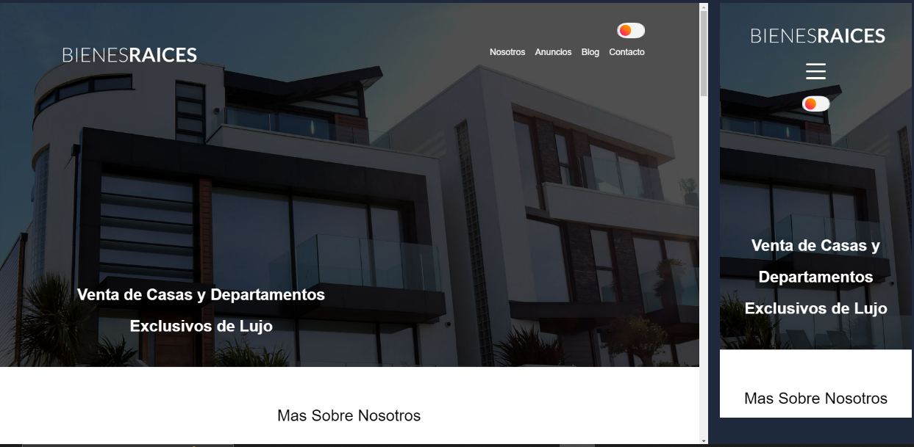
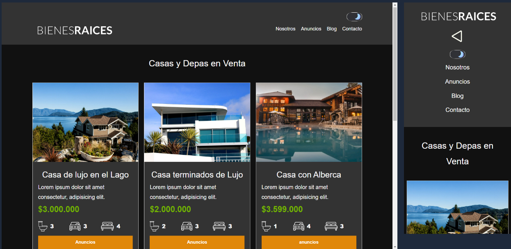
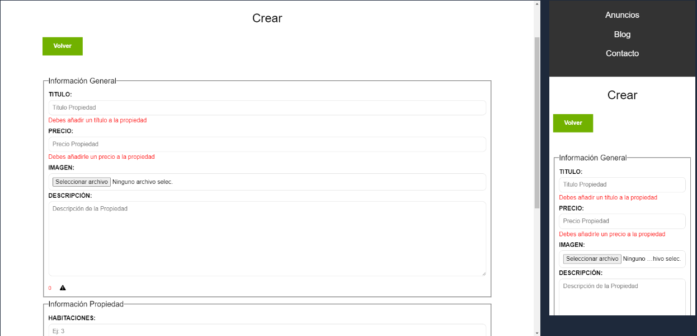

# Bienes Raices Angular-PHP

## Inicio

## Anuncios

## Admin

Es un proyecto realizado en un curso, donde le añadí complegidad y funcionalidades que no estaban en el curso.

## Front
En el front se utilizó:
* Angular ~16.2.0
* Router
* Herencia de SCSS

## Back
En el Back se utilizó:
* PHP  8.1.18
* Inserciones al servidor