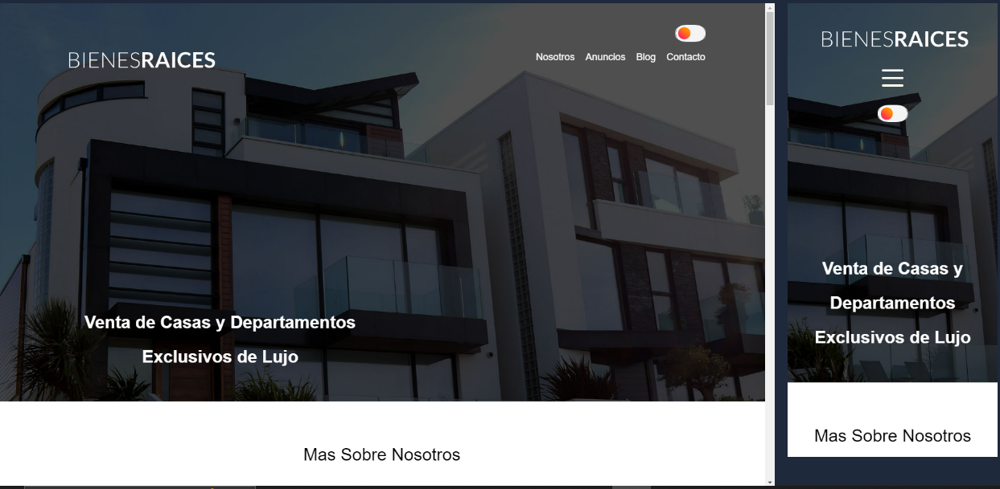
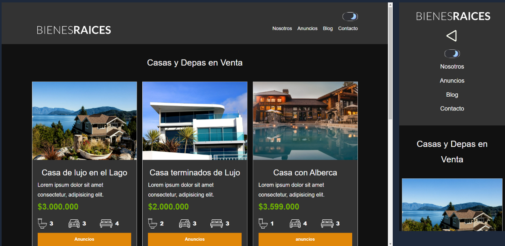
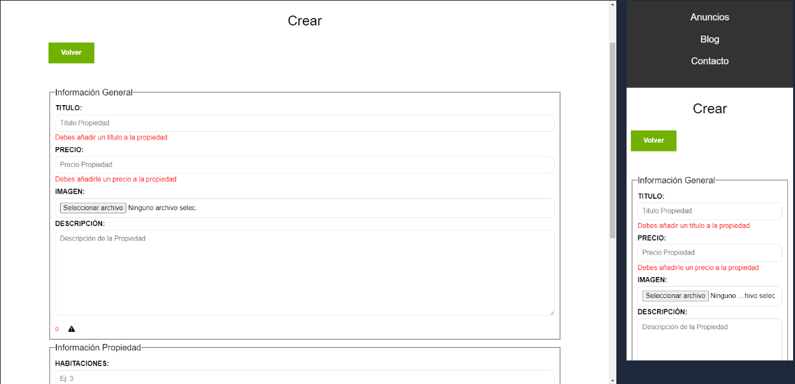

# Bienes Raices Angular-PHP

## /inicio

## /anuncios

## /admin


Es un proyecto realizado en un curso, donde le añadí complegidad y funcionalidades que no estaban en el curso.

## Front
En el front se utilizó:
* Angular ~16.2.0
* Router
* Herencia de SCSS

## Back
En el Back se utilizó:
* Nestjs - v10.3.0
```
https://github.com/facundo000/backend-bienesRaices-nest
```
## ruta
```
http://localhost:4200/admin
```
## Refactorización

 ~~1. Que el usuario pase por el login (usuario ya definido) ~~

 ~~ 2. Que cambie el login por Dasboard (para no redirijisrse al login)  ~~

~~3. Modificar el acceso a las rutas~~

4. Reacer el crud del dashboard (curso CRUD Heroes)
